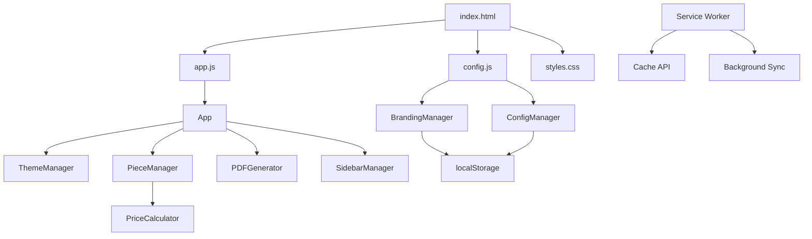

# 📁 Estructura del Proyecto Forge3D

Esta documentación describe la organización de archivos y directorios del proyecto.

```
forge3d-cotizador/
├── 📄 index.html                 # Página principal de la aplicación
├── 📄 manifest.json             # Configuración PWA
├── 📄 sw.js                     # Service Worker para funcionalidad offline
├── 📄 .htaccess                 # Configuración del servidor Apache
├── 📄 README.md                 # Documentación principal
├── 📄 CONTRIBUTING.md           # Guía para contribuidores
├── 📄 LICENSE                   # Licencia MIT
├── 📄 PROJECT_STRUCTURE.md      # Este archivo
├── 📄 Dockerfile                # Configuración Docker
├── 📄 docker-compose.yml        # Orquestación Docker
├── 📄 .env.example              # Variables de entorno de ejemplo
├── 📄 .gitignore                # Archivos ignorados por Git
│
├── 📁 assets/                   # Recursos estáticos
│   ├── 📁 css/
│   │   └── 📄 styles.css        # Estilos principales optimizados
│   ├── 📁 js/
│   │   ├── 📄 config.js         # Configuración y branding dinámico
│   │   └── 📄 app.js           # Lógica principal de la aplicación
│   └── 📁 images/              # Imágenes y screenshots
│       ├── 📄 icon-192x192.png
│       ├── 📄 icon-512x512.png
│       ├── 📄 screenshot-desktop.png
│       └── 📄 screenshot-mobile.png
│
├── 📁 docker/                   # Configuración Docker
│   ├── 📄 nginx.conf           # Configuración Nginx para container
│   └── 📄 default.conf         # Configuración del sitio
│
├── 📁 docs/                     # Documentación adicional
│   ├── 📄 API.md               # Documentación de la API (futuro)
│   ├── 📄 ARCHITECTURE.md      # Arquitectura del sistema
│   ├── 📄 DEPLOYMENT.md        # Guía de despliegue
│   ├── 📄 CUSTOMIZATION.md     # Guía de personalización
│   └── 📄 TROUBLESHOOTING.md   # Solución de problemas comunes
│
├── 📁 .github/                 # Configuración GitHub
│   ├── 📁 workflows/
│   │   ├── 📄 ci.yml           # Pipeline CI/CD
│   │   ├── 📄 release.yml      # Automatización de releases
│   │   └── 📄 security.yml     # Auditorías de seguridad
│   ├── 📁 ISSUE_TEMPLATE/
│   │   ├── 📄 bug_report.md
│   │   ├── 📄 feature_request.md
│   │   ├── 📄 documentation.md
│   │   └── 📄 question.md
│   └── 📄 PULL_REQUEST_TEMPLATE.md
│
├── 📁 tests/                   # Pruebas automatizadas (futuro)
│   ├── 📁 unit/
│   ├── 📁 integration/
│   └── 📁 e2e/
│
└── 📁 scripts/                 # Scripts de utilidad
    ├── 📄 setup.sh            # Script de configuración inicial
    ├── 📄 deploy.sh           # Script de despliegue
    └── 📄 backup.sh           # Script de respaldo
```

## 📄 Archivos Principales

### 🌐 Frontend
- **`index.html`**: Página principal con estructura HTML optimizada para SEO y accesibilidad
- **`assets/css/styles.css`**: Estilos CSS con variables custom, responsive design y soporte para temas
- **`assets/js/config.js`**: Configuración centralizada y sistema de branding dinámico
- **`assets/js/app.js`**: Lógica principal de la aplicación con arquitectura modular

### ⚙️ Configuración
- **`manifest.json`**: Configuración PWA con iconos, shortcuts y metadatos
- **`sw.js`**: Service Worker para funcionalidad offline y cache inteligente
- **`.htaccess`**: Optimizaciones del servidor (compresión, cache, seguridad)

### 🐳 Docker
- **`Dockerfile`**: Imagen optimizada con Nginx Alpine
- **`docker-compose.yml`**: Orquestación con Traefik para SSL automático
- **`docker/nginx.conf`**: Configuración Nginx para producción
- **`docker/default.conf`**: Configuración específica del sitio

### 🔄 CI/CD
- **`.github/workflows/ci.yml`**: Pipeline completo con testing, build y deploy
- **`.github/workflows/release.yml`**: Automatización de releases con changelog
- **`.github/workflows/security.yml`**: Auditorías de seguridad automáticas

## 🏗️ Arquitectura del Código

### 📊 Diagrama de Flujo


### 🧩 Módulos Principales

#### **ConfigManager**
```javascript
// Gestión de configuración del cotizador
- save()           // Guardar configuración
- load()           // Cargar configuración
- export()         // Exportar a JSON
- import()         // Importar desde JSON
- reset()          // Restaurar valores por defecto
```

#### **BrandingManager**
```javascript
// Sistema de branding dinámico
- load()           // Cargar branding personalizado
- save()           // Guardar configuración de marca
- apply()          // Aplicar branding a la interfaz
- export()         // Exportar configuración de marca
- import()         // Importar configuración de marca
- reset()          // Resetear a valores por defecto
```

#### **PriceCalculator**
```javascript
// Motor de cálculo de precios
- calculatePiece() // Calcular precio de una pieza
- detectSmallPiece() // Detectar piezas pequeñas
- applyCommissions() // Aplicar comisiones de marketplace
- generateBreakdown() // Desglose detallado de costos
```

#### **PieceManager**
```javascript
// Gestión de piezas en la cotización
- add()            // Agregar pieza
- edit()           // Editar pieza existente
- remove()         // Eliminar pieza
- updateQuantity() // Actualizar cantidad
- clearAll()       // Limpiar todas las piezas
```

## 📱 PWA (Progressive Web App)

### 🔧 Características Implementadas
- **Installable**: Puede instalarse en dispositivos móviles y desktop
- **Offline**: Funciona sin conexión usando Service Workers
- **Responsive**: Diseño adaptable a todos los dispositivos
- **Fast**: Optimizado para carga rápida y uso eficiente de recursos

### 📋 Service Worker
```javascript
// Estrategias de cache implementadas:
- Cache First:     Recursos estáticos (CSS, JS, imágenes)
- Network First:   API calls y contenido dinámico
- Stale While Revalidate: Páginas HTML
```

## 🎨 Sistema de Branding

### 🏢 Configuración de Empresa
```javascript
company: {
  name: string,      // Nombre de la empresa
  slogan: string,    // Slogan o descripción
  website: string,   // URL del sitio web
  email: string,     // Email de contacto
  phone: string,     // Teléfono de contacto
  address: string    // Dirección física
}
```

### 🖼️ Gestión de Logos
```javascript
logos: {
  forge: {
    dark: string,    // Logo Forge3D tema oscuro (base64)
    light: string    // Logo Forge3D tema claro (base64)
  },
  company: {
    dark: string,    // Logo empresa tema oscuro (base64)
    light: string    // Logo empresa tema claro (base64)
  }
}
```

### 🎨 Colores de Marca
```javascript
colors: {
  primary: string,   // Color primario (#CD9430)
  secondary: string, // Color secundario (#e1aa4a)
  accent: string,    // Color de acento (#B8851F)
  background: {
    dark: string,    // Fondo tema oscuro
    light: string    // Fondo tema claro
  }
}
```

## 🔧 Personalización

### 📝 Variables CSS Dinámicas
```css
:root {
  --accent-primary: var(--brand-primary, #CD9430);
  --accent-secondary: var(--brand-secondary, #e1aa4a);
  --brand-accent: var(--brand-accent-color, #B8851F);
}
```

### ⚙️ Configuración Adaptable
- **Elementos mostrar/ocultar**: Logos, información de empresa, redes sociales
- **Funcionalidades**: Cambio de tema, configuración avanzada
- **Exportar/Importar**: Configuraciones completas en JSON

## 📊 Métricas y Optimización

### 🚀 Performance Targets
- **LCP (Largest Contentful Paint)**: < 2.5s
- **FID (First Input Delay)**: < 100ms
- **CLS (Cumulative Layout Shift)**: < 0.1
- **TTI (Time to Interactive)**: < 3.5s

### 📈 Optimizaciones Implementadas
- **Compresión GZIP**: Archivos CSS/JS/HTML
- **Cache Headers**: Estrategias optimizadas por tipo de archivo
- **Lazy Loading**: Imágenes y recursos no críticos
- **Minificación**: CSS y JavaScript en producción
- **Debouncing**: Inputs para mejor UX
- **Virtual Scrolling**: Listas grandes (futuro)

## 🔒 Seguridad

### 🛡️ Headers Implementados
- **Content Security Policy**: Prevención XSS
- **X-Frame-Options**: Protección clickjacking
- **X-Content-Type-Options**: Prevención MIME sniffing
- **Referrer-Policy**: Control de información de referencia

### 🔐 Validación de Datos
- **Client-side**: Validación inmediata en formularios
- **Sanitización**: Limpieza de datos de entrada
- **Escape**: Prevención de inyección de código

## 📚 Documentación Adicional

- **[API.md](docs/API.md)**: Documentación de endpoints (futuro)
- **[ARCHITECTURE.md](docs/ARCHITECTURE.md)**: Decisiones arquitectónicas
- **[DEPLOYMENT.md](docs/DEPLOYMENT.md)**: Guías de despliegue detalladas
- **[CUSTOMIZATION.md](docs/CUSTOMIZATION.md)**: Guía completa de personalización
- **[TROUBLESHOOTING.md](docs/TROUBLESHOOTING.md)**: Problemas comunes y soluciones